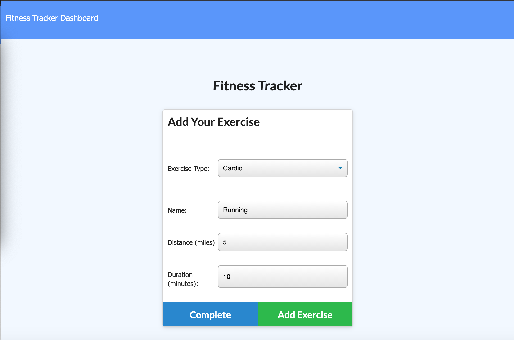

## Fitness Tracker

 ## Table of Contents
- [Description](#description)
- [Installation](#installation)
- [Questions](#contact)
- [Contact](#contact)

 ## Description:
 
 Fitness Tracker lets the user to create and track daily workouts. The application tracks name, type of workout, weight, sets, reps, and duration of excercise. 
  
 

 ## Installation:
    NPM Install

 ## Questions:
    For questions, you can go to my GitHub page at the following Link:

    - [GitHub Profile](https://github.com/DewdropStudio)

 ## Contact:
   For additional questions please reach out to my email rocio.avila@northwestern.edu
